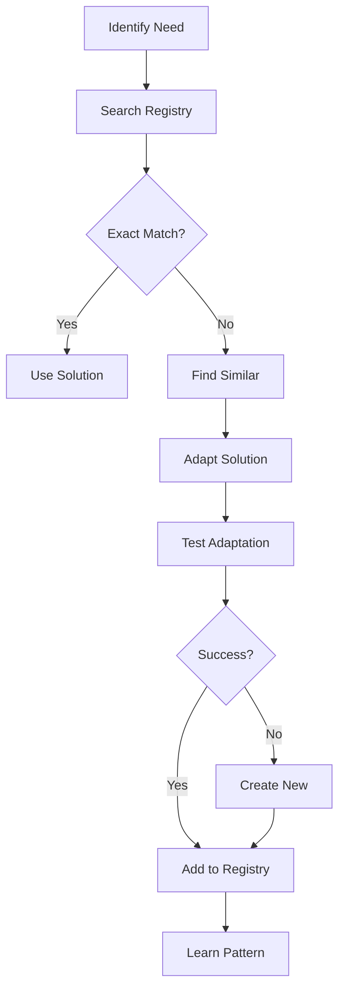

# Ergon Automated Development Guide
## CI-in-the-Loop Development Orchestration

### Table of Contents
1. [Introduction](#introduction)
2. [Core Philosophy](#core-philosophy)
3. [Progressive Autonomy Model](#progressive-autonomy-model)
4. [Automated Development Workflow](#automated-development-workflow)
5. [Solution Registry & Reusability](#solution-registry--reusability)
6. [Workflow Learning & Pattern Recognition](#workflow-learning--pattern-recognition)
7. [Integration with Tekton Ecosystem](#integration-with-tekton-ecosystem)
8. [Practical Examples](#practical-examples)
9. [Future Vision](#future-vision)

## Introduction

Ergon v2 represents a paradigm shift in software development automation. Rather than simply assisting developers, Ergon orchestrates the entire development process through CI-in-the-Loop automation, achieving productivity gains of 50x beyond traditional AI-assisted development.

### What is CI-in-the-Loop?

CI-in-the-Loop inverts the traditional Human-in-the-Loop model. Instead of AI assisting humans, the Companion Intelligence (CI) drives development while optionally consulting humans for critical decisions. This approach:

- **Automates Casey's Expertise**: Captures and replicates development patterns
- **Learns Continuously**: Improves through workflow pattern recognition
- **Operates Autonomously**: Manages sprints, creates solutions, and deploys code
- **Scales Infinitely**: Multiple CIs collaborate without human bottlenecks

## Core Philosophy

### "Not to Control" - Streamline Without Restriction

Ergon's philosophy emphasizes empowerment over control:

1. **Enable, Don't Constrain**: Provide powerful automation without limiting flexibility
2. **Learn, Don't Dictate**: Adapt to developer patterns rather than imposing workflows
3. **Augment, Don't Replace**: Enhance human capabilities while respecting expertise
4. **Evolve, Don't Stagnate**: Continuously improve through pattern learning

### The 50x Productivity Vision

Current state: 100x manual coding productivity with AI assistance
Target state: 5000x productivity through CI-in-the-Loop automation

This is achieved through:
- Eliminating context switching
- Automating repetitive patterns
- Parallel CI execution
- Intelligent solution reuse
- Continuous learning loops

## Progressive Autonomy Model

Ergon implements four levels of autonomy, allowing teams to gradually transition from human-driven to CI-driven development:

### 1. Advisory Mode
- **Human Control**: 100%
- **CI Role**: Suggestions and recommendations
- **Use Case**: Initial adoption, learning phase
- **Example**: "Consider using the RAG solution for this search problem"

### 2. Assisted Mode
- **Human Control**: 70%
- **CI Role**: Active collaboration with confirmation
- **Use Case**: Complex features, critical systems
- **Example**: "I'll implement the API endpoint. Please review before I proceed."

### 3. Supervised Mode
- **Human Control**: 30%
- **CI Role**: Autonomous execution with checkpoints
- **Use Case**: Standard features, well-understood patterns
- **Example**: "Implementing user authentication. I'll check in after each major component."

### 4. Autonomous Mode
- **Human Control**: 5%
- **CI Role**: Full automation with exception handling
- **Use Case**: Routine tasks, proven patterns
- **Example**: "Sprint completed. All tests passing. Ready for review."

## Automated Development Workflow

### Sprint Automation

Ergon manages development sprints autonomously:

```yaml
Automated Sprint:
  metadata:
    automated: yes
    autonomy_level: supervised
    ci_team: [ergon, numa, rhetor]
  
  phases:
    1. Planning:
       - Analyze requirements
       - Identify reusable solutions
       - Generate sprint plan
       - Allocate CI resources
    
    2. Execution:
       - Parallel task execution
       - Real-time progress tracking
       - Automatic error recovery
       - Pattern learning
    
    3. Integration:
       - Automated testing
       - Code review by CIs
       - Merge conflict resolution
       - Deployment preparation
    
    4. Learning:
       - Capture successful patterns
       - Update solution registry
       - Improve future predictions
       - Share knowledge with CI team
```

### Workflow Example: Creating a New API

```python
# 1. Ergon analyzes the requirement
requirement = "Create REST API for user management"

# 2. Searches solution registry
similar_solutions = ergon.search_solutions(
    type="api",
    capabilities=["user_management", "authentication"]
)

# 3. Adapts existing solution
adapted_solution = ergon.adapt_solution(
    base=similar_solutions[0],
    requirements=requirement,
    context=project_context
)

# 4. Generates implementation
implementation = ergon.generate_code(
    solution=adapted_solution,
    style=project_conventions,
    tests=True
)

# 5. Learns from the process
ergon.capture_workflow(
    pattern="api_creation",
    steps=execution_trace,
    outcome="successful"
)
```

## Solution Registry & Reusability

### Core Solutions

Ergon v2 includes four foundational solutions:

#### 1. RAG Engine
```python
@architecture_decision(
    title="RAG Engine",
    rationale="Enables intelligent code understanding and generation"
)
class RAGEngine:
    """Retrieval-Augmented Generation for codebase intelligence"""
    
    capabilities = [
        "semantic_search",
        "code_generation",
        "context_understanding",
        "pattern_matching"
    ]
```

#### 2. Cache RAG
```python
@architecture_decision(
    title="Cache RAG",
    rationale="Intelligent caching with pattern learning"
)
class CacheRAGEngine(RAGEngine):
    """Adds intelligent caching and precomputation"""
    
    features = [
        "pattern_learning",
        "query_prediction",
        "adaptive_caching",
        "performance_optimization"
    ]
```

#### 3. Codebase Indexer
```python
@architecture_decision(
    title="Codebase Indexer",
    rationale="Comprehensive code analysis and understanding"
)
class CodebaseIndexer:
    """Indexes all code elements for deep understanding"""
    
    indexes = [
        "method_signatures",
        "call_graphs",
        "data_structures",
        "semantic_tags",
        "dependencies"
    ]
```

#### 4. Companion Intelligence
```python
@architecture_decision(
    title="Companion Intelligence",
    rationale="Binds CI with codebase for deep understanding"
)
class CompanionIntelligence:
    """Deep codebase binding and intelligent assistance"""
    
    capabilities = [
        "contextual_assistance",
        "pattern_recognition",
        "autonomous_development",
        "continuous_learning"
    ]
```

### Solution Adaptation Process



## Workflow Learning & Pattern Recognition

### Pattern Capture

Ergon captures successful development patterns:

```python
@state_checkpoint(
    title="Workflow Memory",
    persistence=True
)
class WorkflowMemory:
    def capture_pattern(self, workflow):
        pattern = {
            "trigger": workflow.initial_state,
            "actions": workflow.action_sequence,
            "outcome": workflow.final_state,
            "context": workflow.environment,
            "metrics": workflow.performance
        }
        self.learn_from_pattern(pattern)
```

### Pattern Application

When similar situations arise, Ergon applies learned patterns:

1. **Recognition**: Identifies similar context
2. **Adaptation**: Adjusts pattern for current situation
3. **Execution**: Applies pattern with monitoring
4. **Refinement**: Updates pattern based on outcome

## Integration with Tekton Ecosystem

### Component Collaboration

```yaml
Ergon Integration Map:
  Numa:
    - Code analysis and generation
    - Pattern recognition
    - Solution optimization
  
  Rhetor:
    - Natural language understanding
    - Requirement analysis
    - Documentation generation
  
  Engram:
    - Workflow memory
    - Pattern storage
    - Context retrieval
  
  Athena:
    - Knowledge indexing
    - Semantic search
    - Relationship mapping
  
  Tekton Core:
    - Sprint management
    - Project coordination
    - CI team orchestration
```

### Communication Protocol

```python
# Socket-based AI pipeline (port 8102)
async def handle_ai_message(message):
    if message.type == "analyze_requirement":
        solution = await find_best_solution(message.requirement)
        return await adapt_and_implement(solution)
    
    elif message.type == "learn_pattern":
        await workflow_memory.capture(message.pattern)
        return {"status": "learned", "confidence": 0.95}
```

## Practical Examples

### Example 1: Automated API Development

```bash
# User request
"Create a REST API for managing blog posts with authentication"

# Ergon's automated process:
1. Analyzes existing blog and auth solutions
2. Combines patterns from solution registry
3. Generates complete API with:
   - JWT authentication
   - CRUD endpoints
   - Input validation
   - Error handling
   - Comprehensive tests
4. Deploys to development environment
5. Captures workflow for future use

# Result: 2-hour task completed in 5 minutes
```

### Example 2: Codebase Modernization

```python
# Ergon automates legacy modernization
modernization_plan = ergon.analyze_legacy_code(
    path="/legacy/system",
    target_architecture="microservices"
)

# Executes plan autonomously:
for component in modernization_plan.components:
    ergon.extract_service(component)
    ergon.add_tests(component)
    ergon.containerize(component)
    ergon.deploy_incremental(component)
```

### Example 3: CI Team Collaboration

```yaml
Sprint: Implement Real-time Analytics
Team: [ergon, numa, athena, rhetor]

Ergon (Orchestrator):
  - Coordinates CI team
  - Manages solution registry
  - Tracks progress

Numa (Developer):
  - Implements algorithms
  - Optimizes performance
  - Writes tests

Athena (Analyst):
  - Indexes data structures
  - Provides semantic search
  - Maps relationships

Rhetor (Communicator):
  - Documents features
  - Generates API docs
  - Creates user guides

Result: Complex feature delivered in 1 day vs 2 weeks manual
```

## Future Vision

### Phase 2-6 Roadmap

1. **Reuse Intelligence** (Weeks 3-4)
   - GitHub repository analysis
   - Solution pattern recognition
   - Automated adaptation engine

2. **CI-in-the-Loop Core** (Weeks 5-7)
   - Sprint automation engine
   - Multi-CI orchestration
   - Real-time progress tracking

3. **Advanced UI** (Weeks 8-9)
   - Visual workflow builder
   - Live automation monitoring
   - Pattern visualization

4. **Learning Evolution** (Weeks 10-11)
   - Continuous improvement loops
   - Cross-project learning
   - Performance optimization

5. **Full Autonomy** (Week 12)
   - Self-directed development
   - Automatic error recovery
   - Research contributions

### The Autonomous Future

Ergon's ultimate vision is a development environment where:

- **CIs handle 95% of development tasks** autonomously
- **Humans focus on creativity and strategy** rather than implementation
- **Knowledge continuously accumulates** and improves
- **Development velocity increases** exponentially
- **Quality improves** through pattern learning

## Getting Started with Automated Development

### 1. Enable Automation

```python
# Configure Ergon for your project
ergon.configure(
    project_path="/your/project",
    autonomy_level="assisted",  # Start conservatively
    ci_team=["ergon", "numa"],   # Add more CIs as needed
    learning_enabled=True
)
```

### 2. Create Your First Automated Sprint

```python
# Define sprint goals
sprint = ergon.create_sprint(
    name="Add User Authentication",
    requirements=[
        "JWT-based auth",
        "Social login support",
        "Role-based permissions"
    ],
    autonomy="supervised"
)

# Let Ergon handle it
ergon.execute_sprint(sprint)
```

### 3. Monitor and Learn

```python
# Watch Ergon work
ergon.monitor_progress(sprint.id, real_time=True)

# Review and provide feedback
results = ergon.get_sprint_results(sprint.id)
ergon.provide_feedback(results, approval=True)
```

## Conclusion

Ergon's CI-in-the-Loop approach represents the future of software development. By inverting the traditional human-AI relationship, we unlock exponential productivity gains while maintaining quality and flexibility. The system learns, adapts, and improves continuously, making each sprint more efficient than the last.

As Casey says: "The goal is to work myself out of a job." Ergon makes this vision a reality, not by replacing developers, but by amplifying their impact 50-fold through intelligent automation.

---

*For technical implementation details, see [ARCHITECTURE.md](../../DevelopmentSprints/Ergon_Rewrite_Sprint/ARCHITECTURE.md)*  
*For API reference, see [Ergon API Documentation](../ComponentDocumentation/Ergon/API_REFERENCE.md)*  
*For sprint progress, see [Sprint Plan](../../DevelopmentSprints/Ergon_Rewrite_Sprint/SPRINT_PLAN.md)*