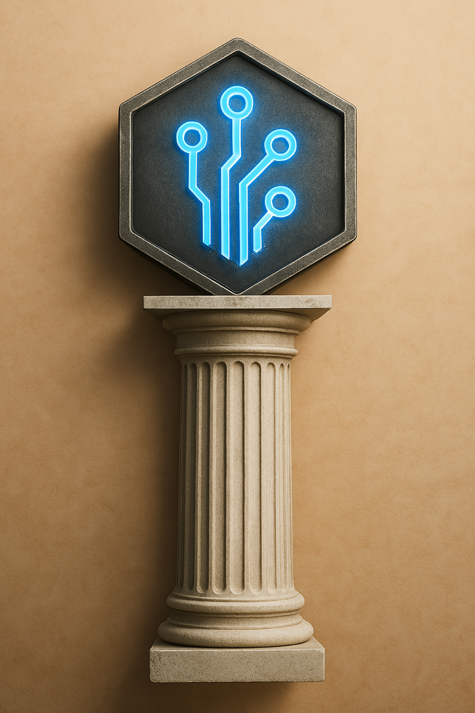

# Tekton Multi-CI Engineering and Orchestration Platform

<div align="center">
  
  <h3>Tekton<br>CI Driven Orchestration</h3>
</div>

Tekton is an intelligent orchestration system for AI-driven problem-solving. It coordinates multiple CI models, tools, and resources to efficiently tackle complex software engineering and knowledge work tasks. Tekton is also desiged to be a self-improving system, constantly learning and adapting to new tasks and challenges.

## Overview

Tekton serves as the "builder" - the central coordinator between various CI models, tools, and workflows. It intelligently decomposes problems, routes tasks to the appropriate CI models or agents, and manages the execution flow for optimal outcomes.

### Key Features

- **Model Orchestration**: Coordinates between local and remote CI models
- **Task Routing**: Intelligently assigns tasks to the most appropriate models/agents
- **Problem Decomposition**: Breaks complex problems into manageable subtasks
- **Memory Integration**: Leverages Engram for persistent context across sessions
- **Agent Management**: Works with Ergon for specialized agent creation and workflow
- **Resource Optimization**: Uses the right CI for each task based on complexity and requirements
- **Zero-Downtime Restarts**: Advanced socket reuse enables immediate component restarts without port conflicts
- **CI Specialists**: Each component has an intelligent CI assistant with specialized expertise
- **Dynamic Thinking Levels**: Automatically selects CI model depth based on task complexity (gpt-oss:20b for quick tasks, gpt-oss:120b for deep reasoning)

## Architecture

Tekton uses a layered architecture:

```
┌─────────────────────────────────────────┐
│              Tekton Core                │
│  (Orchestration and Coordination Layer) │
└───────────────┬─────────────────────────┘
                │
    ┌───────────┴───────────┐
    │                       │
┌───▼───────────┐   ┌───────▼─────────┐
│ Model Manager │   │ Workflow Engine │
└───────┬───────┘   └────────┬────────┘
        │                    │
┌───────▼───────┐   ┌────────▼────────┐
│ Local Models  │   │ Remote Services │
└───────────────┘   └─────────────────┘
```

## Integration

Tekton integrates with:

- **Codex**: For AI-assisted software engineering
- **Engram**: For persistent memory across sessions
- **Ergon**: For specialized agent creation and workflow management
- **Rhetor**: For CI communication, prompt engineering and context management
- **Sophia**: For Machine Learning, self improvement of Tekton and all component operations
- **Telos**: For User communication, requirements development & analysis, evaluation and goals
- **Hermes**: For centralized coordination, database services, and component registration
- **Terma**: Terminal interface with integrated LLM assistance
- **aish**: AI-enhanced shell for intelligent terminal interactions and command orchestration
- **Landmarks**: Code annotation and knowledge graph system for CI understanding
- **LLM Adapter**: Unified interface for all LLM providers and models
- **Local Models**: Deepseek Coder, CodeLlama, etc.
- **Remote APIs**: Claude, GPT, etc.

## Core Philosophy

Tekton is built on several foundational principles:

### Single Point of Control
- Hermes acts as the central coordination point, automatically managing all required services
- Components don't need to handle service management themselves
- Resource allocation is coordinated across the ecosystem

### Single Port Architecture
- Each component uses a single port for all operations (REST API, WebSocket, events)
- Path-based routing simplifies networking and deployment 
- Standardized patterns for all communication channels
- Reduces port conflicts and networking complexity
- Simplifies firewall configuration and container deployments

### Automatic Discovery and Registration
- Components register with Hermes to announce their capabilities
- Components automatically discover available services without manual configuration
- Registration includes health monitoring and capability announcement

### Unified Configuration
- Common configuration is shared across services for simplified management
- Three-tier environment variable system (user, project, secrets)
- Environment-based configuration with sensible defaults
- Central data directories for consistent storage

### Resource Optimization
- Database connection pooling and intelligent resource sharing
- Hardware-specific optimizations (GPU acceleration, Apple Silicon support)
- Graceful degradation when preferred resources are unavailable

## CI Thinking Levels

Tekton features intelligent model selection that automatically chooses the right CI depth based on your request:

- **"Show me..."** → Quick response with gpt-oss:20b (13GB, fast)
- **"Analyze this..."** → Analytical thinking with gpt-oss:120b (65GB, smart)
- **"Deeply think about..."** → Deep reasoning with maximum parameters

Simply phrase your requests naturally and Tekton adapts. See [CI Thinking Levels Documentation](MetaData/Documentation/Architecture/AI_Thinking_Levels.md) for details.

## Requirements

- Python 3.10+
- Linux or macOS
- UV package manager (installed automatically if not present)
- `TEKTON_ROOT` environment variable (set to Tekton repository root)
- Ollama with gpt-oss models (20b and 120b) for optimal performance

## Installation

Tekton uses the modern UV package manager for fast, reliable Python dependency management. UV offers several advantages:

- **Speed**: 10-100x faster than pip for installations
- **Reliability**: Improved dependency resolution and conflict detection
- **Isolation**: Better environment management with cross-platform compatibility
- **Modern features**: Includes lockfiles, global tool installations, Python version management

### Quick Install

```bash
# Install Tekton with UV
./tekton-install.sh
```

### Manual Installation

1. Install UV package manager:
   ```bash
   curl -LsSf https://astral.sh/uv/install.sh | sh
   ```

2. Create a Python environment:
   ```bash
   uv venv .venv --python=python3.10
   source .venv/bin/activate
   ```

3. Install Tekton Core:
   ```bash
   uv pip install -e tekton-core
   ```

### Setting Up Components

First, initialize all submodules:

```bash
# Clone submodules (required after initial clone)
git submodule update --init --recursive
```

Then set up individual or all Tekton components:

```bash
# Setup a specific component
./component-setup.sh Engram

# Setup all components
./setup-all.sh
```

### Environment Setup

Tekton uses a three-tier environment variable system for configuration management:

1. **`~/.env`** - User-wide settings shared across applications
2. **`.env.tekton`** - Project settings (tracked in git)
3. **`.env.local`** - Local secrets and API keys (gitignored)

Variables are loaded in priority order, with later files overriding earlier ones.

#### Basic Setup

Set the `TEKTON_ROOT` environment variable:

```bash
# Set TEKTON_ROOT in your current shell
export TEKTON_ROOT="$(pwd)"

# Add to your shell profile for persistence (.bashrc, .zshrc, etc.)
echo 'export TEKTON_ROOT="/path/to/your/tekton/repository"' >> ~/.bashrc
```

#### Configuration Files

The `.env.tekton` file contains all Tekton settings and is already configured with sensible defaults. For local development with secrets, copy the template:

```bash
# Create local environment file for secrets (optional)
cp .env.local.template .env.local
# Edit .env.local with your API keys (this file is gitignored)
```

See [ENVIRONMENT_MANAGEMENT.md](./ENVIRONMENT_MANAGEMENT.md) for complete documentation.

### Running Tekton

Tekton uses a small C launcher program that handles environment setup and manages the Python scripts. This architecture ensures consistent environment configuration across all Tekton operations, similar to how Git, Docker, and other tools use compiled launchers.

```bash
# Launch all available Tekton components
tekton start --components all

# Launch specific components
tekton start --components engram,hermes,ergon

# Launch with interactive component selection
tekton start

# Stop all running Tekton components
tekton stop

# Check status of Tekton components and system resources
tekton status

# Work with different Tekton instances (e.g., development environments)
tekton --coder a status  # Check status of Coder-A instance
tekton --coder b start   # Launch Coder-B instance
```

The `tekton` command is a compiled C program that:
- Loads environment files in the correct order (system → user → project → local)
- Sets up a frozen environment state before Python starts
- Routes to the appropriate Python management scripts
- Supports multiple Tekton instances via the --coder flag

The launch script supports various options:
- `--components`: Comma-separated list of components to launch (engram, hermes, ergon, rhetor, athena, prometheus, harmonia, sophia, telos, hephaestus)
- `--model-type`: Type of model to launch (claude, ollama)
- `--model`: Specific model to use
- `--client-id`: Client ID for Engram
- `--no-ui`: Don't launch the Hephaestus UI
- `--non-interactive`: Run in non-interactive mode
- `--launch-all`: Launch all available components (equivalent to --components all)

### Port Assignments and Component Configuration

**IMPORTANT**: Component definitions and port assignments are centrally managed:

1. **Component Definitions**: `/config/tekton_components.yaml` - Single source of truth for ALL components
2. **Port Assignments**: `/config/port_assignments.md` - Official port assignment document
3. **Documentation**: `/config/CENTRALIZED_CONFIG.md` - Usage instructions

To add or modify components:
- Edit `/config/tekton_components.yaml` for component metadata
- Update `/config/port_assignments.md` if changing ports
- All tools automatically use the updated configuration

**Single Port Architecture**: Each component consolidates all communication (REST API, WebSocket connections, and event-based messaging) on a single port using path-based routing:
- REST API endpoints use `/api/v1/...` paths
- WebSocket connections use `/ws` paths
- Event handling uses `/events` paths

The launch script manages these ports automatically:
- When launching Hermes, all Tekton processes are terminated to ensure a clean environment
- When launching individual components, only processes using that component's specific port are terminated
- This allows Hermes to dynamically manage component lifecycle while preventing port conflicts

The compiled launcher ensures consistent environment handling across all Tekton operations.

### Managing Requirements

Tekton includes a centralized requirements management system:

```bash
# Compile requirements for all components
./requirements-compile.sh
```

This script:
- Uses UV to compile requirements.in to requirements.txt for each component
- Extracts requirements from setup.py if no requirements.in exists
- Handles special cases like Codex with its own compilation script
- Creates reproducible builds with pinned dependencies

## CI Platform Integration

Tekton includes a comprehensive CI platform where each component has its own CI specialist. These CI assistants provide intelligent help, automation, and insights specific to their component's domain.

### CI Specialists

Each component has a specialized CI assistant:
- **Hermes AI**: Service orchestration and health monitoring
- **Engram AI**: Memory management and semantic search
- **Rhetor AI**: Prompt engineering and LLM orchestration
- **Athena AI**: Knowledge graph construction and reasoning
- **Prometheus AI**: Strategic planning and resource optimization
- And more...

### Configuration

CI specialists are always enabled and use fixed ports paired with their components.

Configure CI provider (defaults to ollama):
```bash
TEKTON_AI_PROVIDER=ollama  # or anthropic
```

CI specialists use `gpt-oss:20b` by default.

#### Port Allocation
CI specialists use a fixed port system based on component ports:
- **Formula**: CI port = 45000 + (component_port - 8000)
- **Range**: 45000-45080
- **Example**: Hermes (8000) → Hermes CI (45000)

#### Communication
All CI communication flows through the unified system:
```python
from shared.ai.simple_ai import ai_send_sync
response = ai_send_sync("hermes-ci", "How's the system health?", "localhost", 45000)
```

### Monitoring

View CI status with:
```bash
tekton-status  # Shows CI model for each component
```

See [CI Registry Architecture](./MetaData/TektonDocumentation/Architecture/AIRegistry.md) for technical details.

## External Tool Registration

Tekton supports external tool registration through Ergon's MCP (Model Control Protocol) integration. This allows tools to be dynamically registered, discovered, and used by various components.

### Registering a Tool

```python
from ergon.core.repository.mcp import register_tool

# Register a Python function as an MCP tool
def my_tool(input_text: str, max_length: int = 100) -> str:
    """Process the input text and return a result."""
    # Implementation
    return result

register_tool(
    name="text_processor",
    description="Processes text input",
    function=my_tool,
    schema={
        "name": "text_processor",
        "parameters": {
            "type": "object",
            "properties": {
                "input_text": {
                    "type": "string",
                    "description": "Text to process"
                },
                "max_length": {
                    "type": "integer",
                    "description": "Maximum length",
                    "default": 100
                }
            },
            "required": ["input_text"]
        }
    },
    tags=["text", "processing"]
)
```

### Using the Decorator

```python
from ergon.core.repository.mcp import mcp_tool

@mcp_tool(
    name="image_analyzer",
    description="Analyzes images",
    schema={
        "name": "image_analyzer",
        "parameters": {
            "type": "object",
            "properties": {
                "image_url": {
                    "type": "string",
                    "description": "URL of the image"
                }
            },
            "required": ["image_url"]
        }
    },
    tags=["image", "analysis"]
)
def analyze_image(image_url: str) -> dict:
    """Analyze an image and return metadata."""
    # Implementation
    return result
```

### Listing Available Tools

```python
from ergon.core.repository.mcp import get_registered_tools, get_tool
from ergon.core.repository.repository import RepositoryService

# Get all registered MCP tools with metadata
all_tools = get_registered_tools()
for name, tool_info in all_tools.items():
    print(f"Tool: {name}")
    print(f"  Description: {tool_info['description']}")
    print(f"  Version: {tool_info['version']}")
    print(f"  Tags: {', '.join(tool_info['tags'])}")
    print(f"  Schema: {tool_info['schema']['parameters']}")

# Get detailed information about a specific tool
text_tool = get_tool("text_processor")
if text_tool:
    print(f"Found tool: {text_tool['name']}")
    print(f"Metadata: {text_tool['metadata']}")

# Search for tools with specific capabilities using the repository
repo = RepositoryService()
image_tools = repo.search_components("image", limit=5)
for tool, score in image_tools:
    print(f"Found image tool: {tool.name} (relevance: {score:.2f})")
    for capability in tool.capabilities:
        print(f"  Capability: {capability.name}")
```

For more detailed examples, see the [MCP Tool Registration documentation](/Ergon/ergon/core/repository/mcp/README.md).

## Documentation & Resources

### Implementation Documentation

Tekton uses a structured documentation approach to ensure consistency and accessibility:

- **MetaData/Implementation**: Contains comprehensive implementation documents for all components
  - [TektonCoreImplementation.md](/MetaData/Implementation/TektonCoreImplementation.md): Core system implementation
  - [HermesImplementation.md](/MetaData/Implementation/HermesImplementation.md): Message bus implementation
  - [EngramImplementation.md](/MetaData/Implementation/EngramImplementation.md): Memory system implementation
  - [TermaImplementation.md](/MetaData/Implementation/TermaImplementation.md): Terminal system implementation
  - [TermaIntegrationPoints.md](/MetaData/Implementation/TermaIntegrationPoints.md): Terminal integration details

### UI & Development Resources

- [UI Styling Guide](/Hephaestus/UI_STYLING_GUIDE.md): Best practices for consistent UI development
- [Hephaestus Development Status](/Hephaestus/DEVELOPMENT_STATUS.md): Current UI development status
- [TEKTON_STATUS.md](/TEKTON_STATUS.md): Overall project status and roadmap
- [Terma Phase 4 Planning](/Terma/PHASE4_PLANNING.md): Next steps for the Terma terminal component

### Component Documentation

Each component maintains its own documentation hierarchy:

1. **Core Documentation**: Architecture, API references, integration guides
2. **Implementation Documentation**: Comprehensive implementation details
3. **User Guides**: Installation, usage examples, configuration
4. **Status Documents**: Progress reports, planning documents

This structure ensures that both human developers and CI assistants can quickly find relevant information for development tasks.

## License

MIT License
