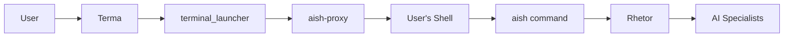

# Terma-aish Integration Architecture

**Date**: July 2, 2025  
**Status**: Implemented  
**Components**: Terma, aish, Rhetor

## Overview

This document describes the integration between Terma (Terminal Management) and aish (AI Shell) within the Tekton platform. The integration provides AI-enhanced terminal sessions with transparent command routing.

## Architecture

### Component Locations

```
Tekton/
├── Terma/                      # Terminal management system
│   └── terma/
│       ├── core/
│       │   └── terminal_launcher_impl.py  # Enhanced to find aish
│       └── api/
│           └── fastmcp_endpoints.py       # MCP endpoints
└── shared/
    └── aish/                   # CI shell integration
        ├── aish                # Main CI command
        ├── aish-proxy          # Transparent shell enhancement
        ├── aish-history        # History management
        └── src/                # Python implementation
```

### Integration Flow



## Implementation Details

### Terminal Launcher Updates

The terminal launcher (`terminal_launcher_impl.py`) was updated to:

1. **Find aish-proxy in Tekton location**:
   ```python
   locations = [
       Path(__file__).parent.parent.parent.parent / "shared" / "aish" / "aish-proxy",
       # ... other fallback locations
   ]
   ```

2. **Launch terminals in user's home directory**:
   ```python
   config.working_dir = os.path.expanduser("~")
   ```

3. **Use user's preferred shell**:
   ```python
   shell_to_use = os.environ.get('SHELL', '/bin/bash')
   ```

### MCP Endpoint

New endpoint added to `fastmcp_endpoints.py`:

```python
@mcp_router.post("/tools/launch_terminal")
async def mcp_launch_terminal(request: Dict[str, Any]) -> Dict[str, Any]:
    """Launch a terminal with aish integration."""
```

**Request Format**:
```json
{
    "name": "Terminal name",
    "working_dir": "/optional/path",
    "purpose": "AI context/purpose",
    "template": "template_name"
}
```

**Response Format**:
```json
{
    "success": true,
    "pid": 12345,
    "terminal_app": "Terminal.app",
    "working_directory": "/Users/username",
    "aish_enabled": true,
    "message": "Successfully launched aish-enabled terminal"
}
```

### Environment Variables

Terma sets these environment variables for aish-enabled terminals:

- `TEKTON_ENABLED="true"` - Indicates Tekton platform
- `AISH_ACTIVE="1"` - Indicates aish is available
- `TEKTON_TERMINAL_PURPOSE` - Optional CI context
- `RHETOR_ENDPOINT` - Override Rhetor location (default: http://localhost:8003)

### Terminal Templates

Pre-configured templates available:

- `default` - Basic aish terminal
- `development` - Development environment with Tekton root
- `ai_workspace` - AI-assisted development with high priority
- `data_science` - Data science configuration

## Usage Examples

### Launch via Command Line

```bash
cd /Tekton/Terma
python -m terma.core.terminal_launcher_impl launch
```

### Launch via MCP

```bash
curl -X POST http://localhost:8004/api/mcp/v2/tools/launch_terminal \
  -H "Content-Type: application/json" \
  -d '{"name": "AI Terminal", "template": "ai_workspace"}'
```

### In Terminal

```bash
# Direct CI command
aish apollo "What is the chronology of programming languages?"

# Piped input
echo "data" | aish athena

# CI pipeline
echo "Write a haiku" | aish apollo | aish athena

# Team chat
aish team-chat "Integration complete!"

# List available CIs
aish -l
```

## Configuration

### Port Configuration

Terma runs on port 8004 (defined by `TERMA_PORT` in `.env.tekton`).

### Path Resolution

The terminal launcher searches for aish-proxy in this order:

1. `/Tekton/shared/aish/aish-proxy` (primary)
2. System PATH
3. Legacy locations (for backward compatibility)

## Future Enhancements

1. **Terminal Registration**: aish-proxy will register with Terma on launch
2. **Health Monitoring**: Periodic health checks from aish to Terma
3. **Command Injection**: Ability to send commands to running terminals
4. **Session Persistence**: Save/restore terminal sessions

## Troubleshooting

### Common Issues

1. **Wrong aish-proxy location**: Ensure Terma is restarted after integration
2. **Port connection refused**: Verify Terma is running (`./run_terma.sh`)
3. **AI routing issues**: Check Rhetor is running on port 8003

### Debug Commands

```bash
# Check which aish-proxy is found
python -c "from terma.core.terminal_launcher_impl import TerminalLauncher; print(TerminalLauncher().aish_path)"

# Test MCP endpoint
curl http://localhost:8004/api/mcp/v2/terminal-status

# Check environment in terminal
env | grep -E "(AISH|TEKTON|RHETOR)"
```

## Related Documentation

- [aish Architecture](/shared/aish/docs/ARCHITECTURE.md)
- [Terma Component Guide](/MetaData/ComponentDocumentation/Terma.md)
- [AI Communication Architecture](AI_Communication_Architecture.md)